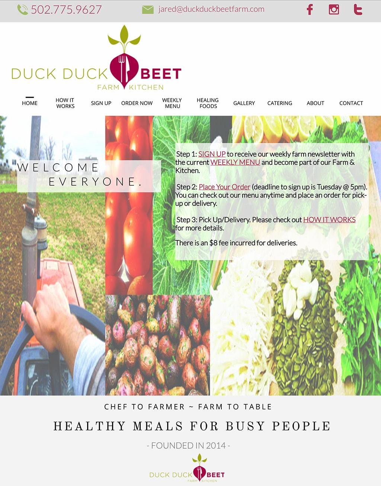
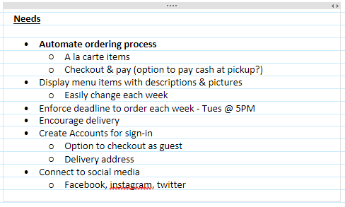
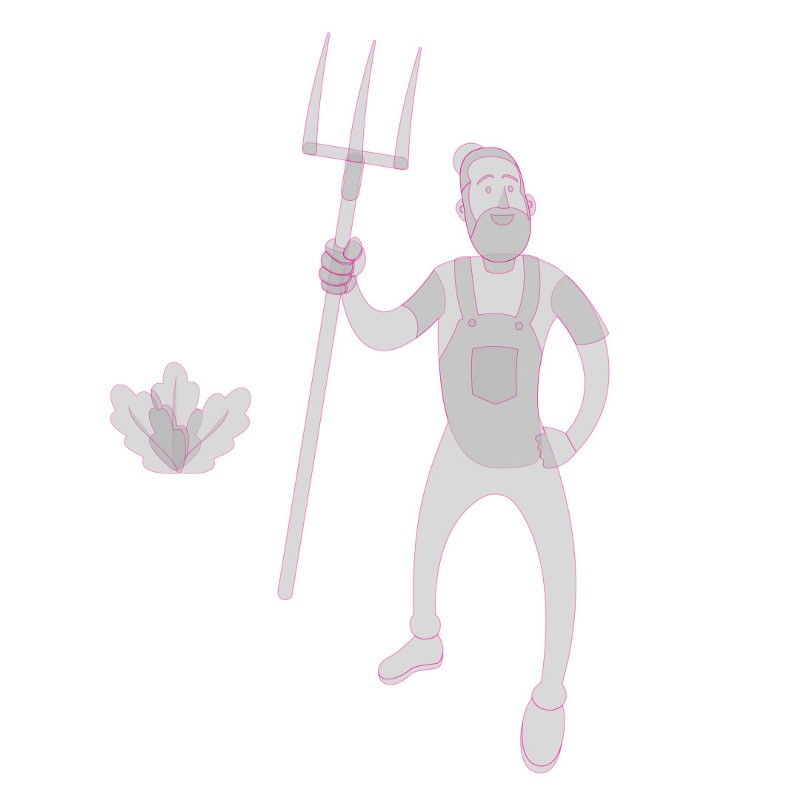
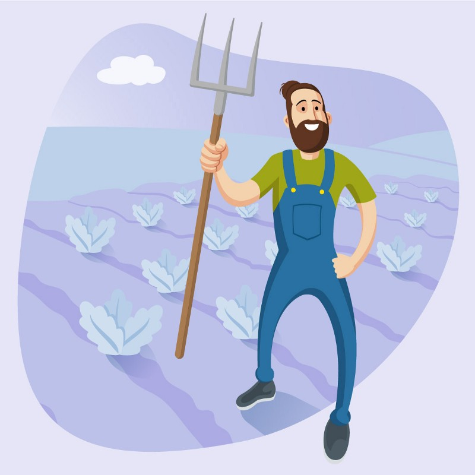
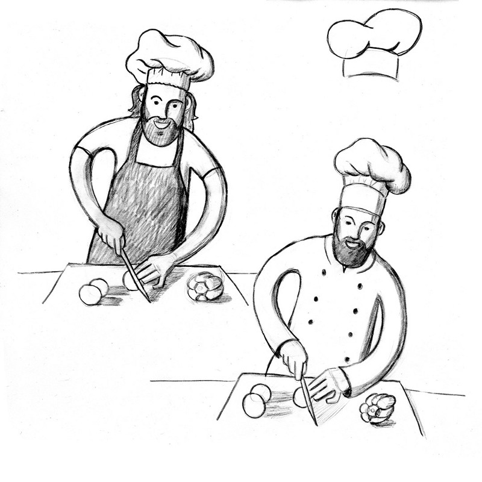
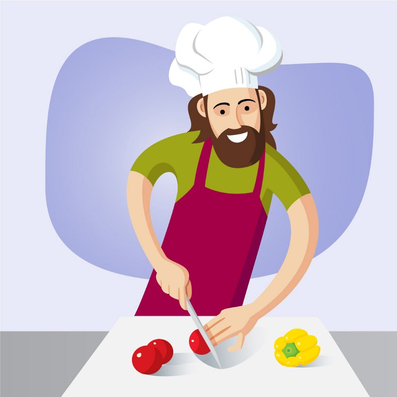
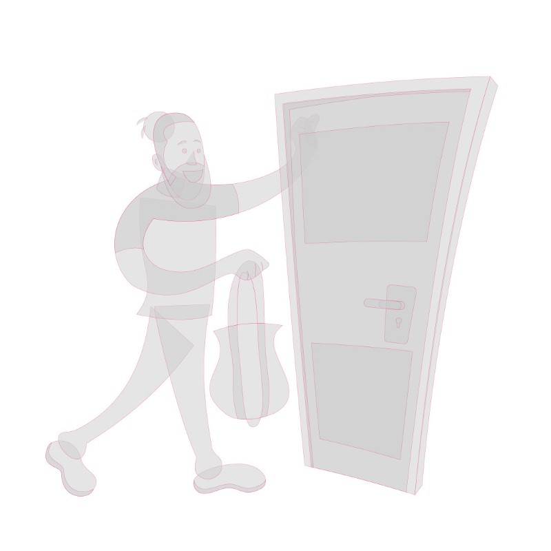

Jared Wilkinson has a very unique business. He is a trained chef with 18 years experience. Several years ago, he fell in love with farming as well. Instead of just selling his homegrown produce, he began turning his harvest into fully prepared meals.

### Goals, Needs & Design Requirements

**Duck Duck Beet Farm & Kitchen** was operating on a weekly opt-in subscription model. **They had a website, but customers could not use it to place orders and it was not mobile responsive.** Jared was switching to an À la carte style menu and needed a **fully functional Ecommerce website.** Processing all of the orders each week through back and forth emails had become overwhelming. He also wanted a website that worked on smartphones and tablets, as well as desktop computers.

I met with Jared in order to learn more about his business, customers, competitors and needs for a website. I compiled the following lists of Goals, Needs, and Design Requirements for the new site in my trusty OneNote app. **The lists helped to keep me on track throughout the entire design and development process.** I am happy to say that I was able to check every item off at the end.

### Content Inventory

In addition to the Goals, Needs, and Requirements, I created a short Content Inventory in Excel. The spreadsheet lists the Pages and Core Assets of the website along with a short description and the items required for each one.

### Wireframe

Next I drew a basic wireframe of my idea for the home page. **One of our goals for the website was to attract new customers.** I was searching for a way to explain Jared’s business to someone new in the most simple and direct way possible. My solution was to create three illustrations that represented his business model in three simple steps.

1.  **We Farm**
2.  **We Cook**
3.  **We Deliver**

### Illustrations

**I knew that the illustrations, if done right, would be something that would catch people’s attention and hopefully peak their interest in Duck Duck Beet.** My first attempts were in more of a Comic Book art style. They were fairly simple line drawings, but still a bit too detailed for the purpose of this home page. Eventually I settled on a more cartoony vector art style that is just abstract enough to make it extremely relatable but still obviously a caricature of Jared himself.

> I was searching for a way to explain Jared’s business to someone new in the most simple and direct way possible. My solution was to create three illustrations that represented his business model in three simple steps. We Farm, We Cook, We Deliver.

### From Analog to Digital

My initial sketches were done on newsprint paper with a **Conte Sketching Pencil**. I then scanned in my sketches and traced them in **Adobe Illustrator** using shapes, the pathfinder palette, and the pen tool. I incorporated the green and magenta colors from the Duck Duck Beet logo where appropriate and complimented them with subtle shades of violet in the background.

### Iconography

After speaking with Jared and several of his customers, **I determined that there were essentially four main reasons why people loved Duck Duck Beet.** It is healthy. It is locally grown and sourced. It is convenient, and most importantly the food is delicious! In order to showcase these qualities I created four icons to represent the top four reasons customers love Jared’s business.

### Pages and Content

Once the graphics were finished it was just a matter of creating the pages from the Content Inventory and plugging in the necessary content. Although I did make a few changes along the way, including the decision to not create a separate page for Catering Services. Instead, I opted to include information about catering on the home page.

I continued to use the same colors from Jared’s logo throughout the website. Magenta is the main color and green is used for links and buttons. The designer of Jared’s logo used two different weights of Gotham. **I chose to use different weights of Montserrat for both the headings and the text of the site.** Montserrat is a really nice Google font and is very similar to Gotham. I tried using a serif font that contrasted well with Gotham for either the headings or the text, but I did not like the result.

I built [duckduckbeetfarm.com](https://duckduckbeetfarm.com/) using Wordpress and the Woocommerce plug-in. I used my absolute favorite theme, **Beaver Builder**, a large amount of custom **CSS**, and little bit of **PHP** to style the site. **Wordpress and Woocommerce made it easy to hand off the website to my customer once it was finished.** After a single sit-down meeting my client, an amazing chef and very capable farmer but definitely not a computer engineer, was adding and removing menu items with pictures and text, and processing orders with no problem at all. **At one point he even said, “That was a lot easier than I thought it was going to be.”**

I’m very proud of the work I did on this project, and **I’m very happy to have improved the User Experience of both the customers and the owner of Duck Duck Beet Farm & Kitchen.**

Take a look at the site using the link below. And if you are in the **Louisville, Kentucky** area, you can try some of Jared’s delicious and healthy food.

[duckduckbeetfarm.com](https://duckduckbeetfarm.com/)

Thanks for reading!
